## Importing datasets from a data source (S3) to Data Wrangler

* In the previous section, we loaded and explored the example notebook explore-data.ipynb. With Data Wrangler, we are going to follow a 3-step approach for transforming our raw data columns into ML-ready feature columns. First, we start by performing some analyses prior to doing data transformations. We then follow by applying few data transformations and finally do more analysis on the transformed data to ensure we improved its quality. We validate this by comparing the results of analyses performed pre and post data transformations. Now, let us walkthrough each individual stage one by one.
* Initialize SageMaker Data Wrangler via SageMaker Studio UI.
  * There are two ways that you can do this, either from the Launcher screen as depicted here:
   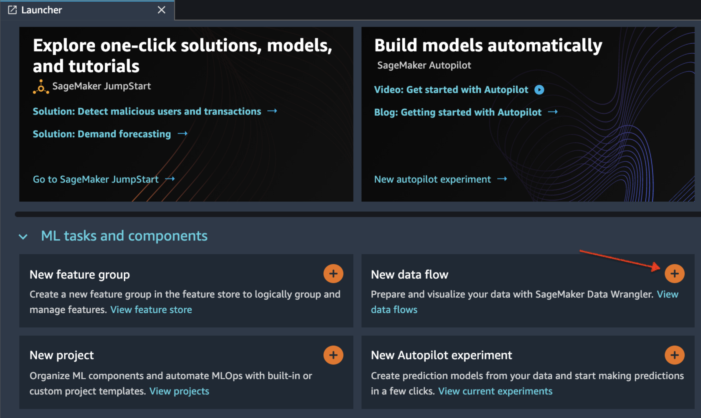
  * Or from the SageMaker resources menu on the left, selecting Data Wrangler, and new flow
   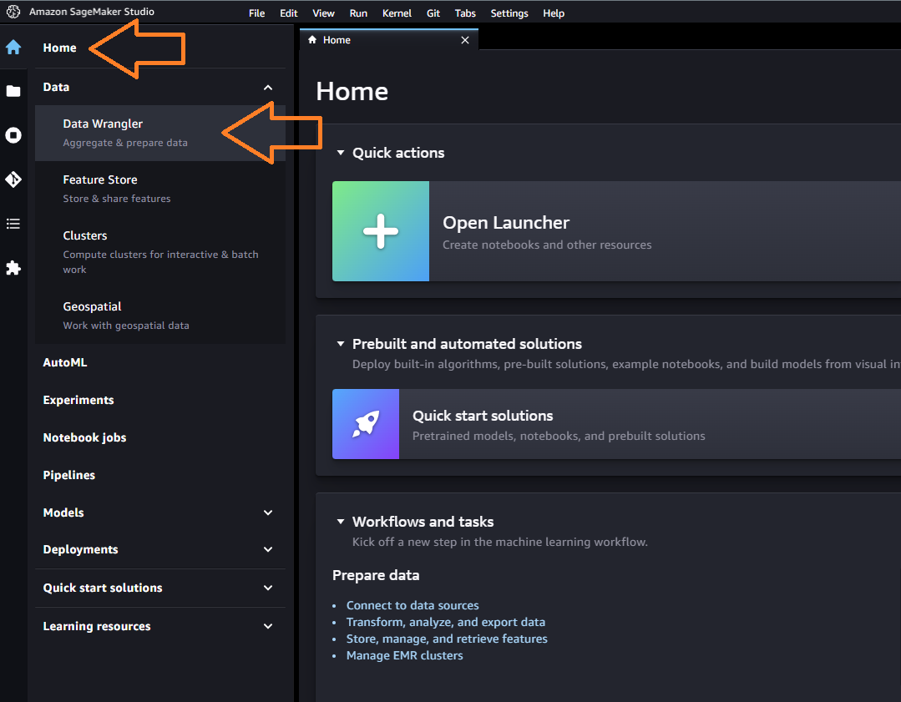
   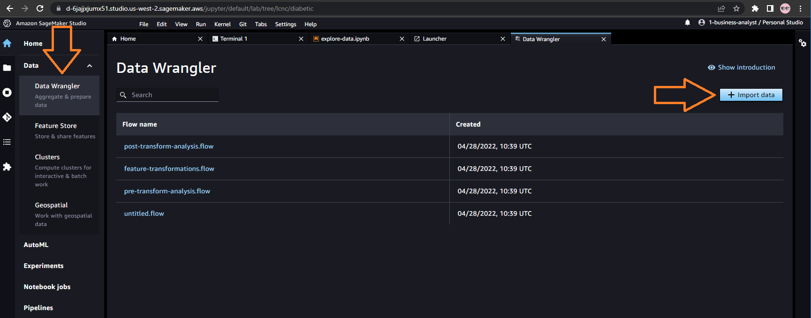
  * Takes a few minutes to load.
   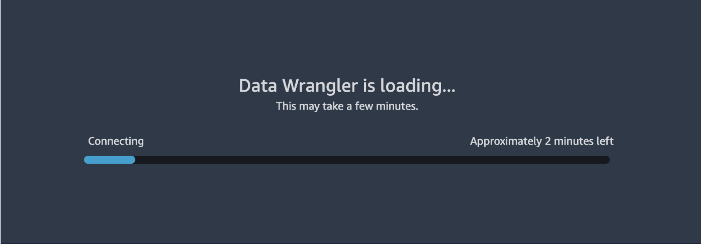
  * Once Data Wrangler is loaded, you should be able to see it under running instances and apps as shown below.
  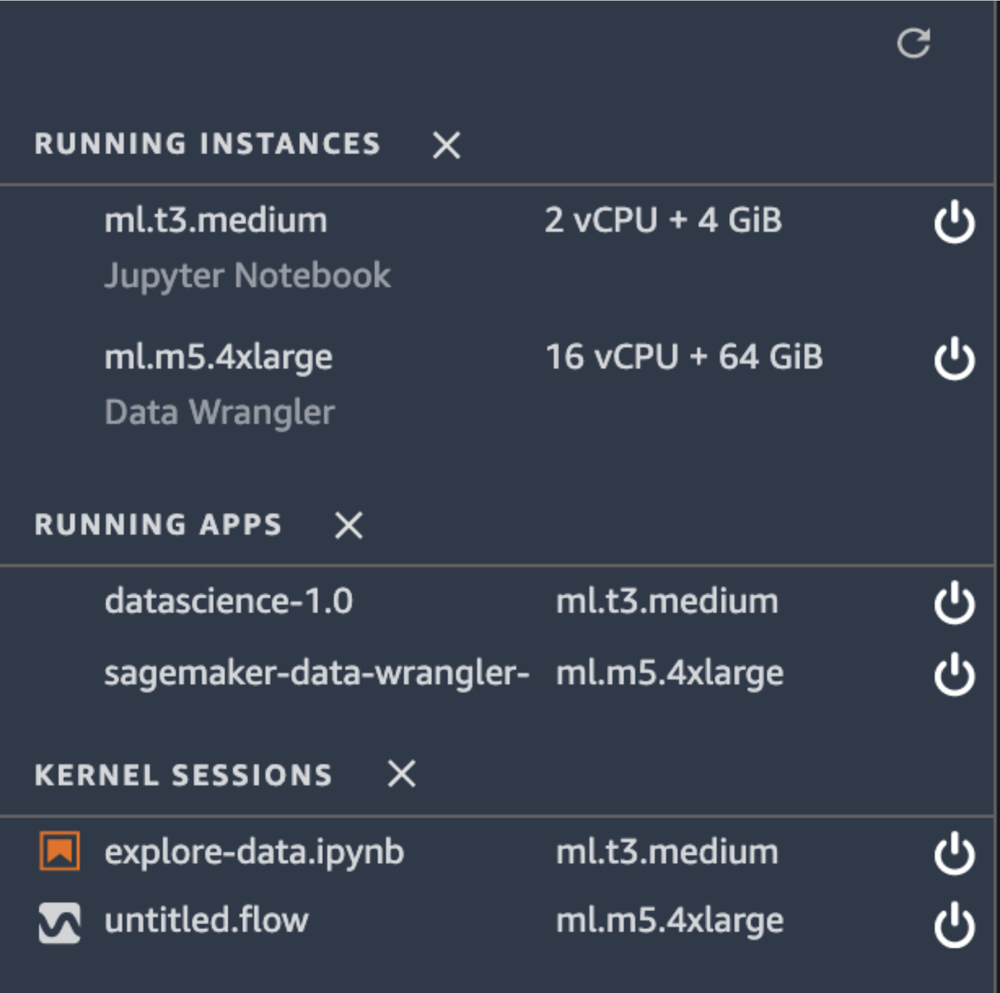
  * Next, make sure you have copied the data paths from the previous section, as you will need them in this section.
  * Once Data Wrangler is up and running, you can see the following data flow interface with options for import, creating data flows and export as shown below.
     
  * Make sure to rename the untitled.flow to your preference (for e.g., join.flow)
  * Paste the S3 URL for the diabetic_readmission.csv file into the search box below

## Pre-transform Analysis
* In this phase, we import the dataset from S3 and do 3 types of analysis. 1) Linear Feature Correlation, 2) Target Leakage and, 3) Quick Model.
* From the Data Wrangler UI, select S3 as data source as shown below.

 
* Navigate to your default bucket and choose diabetic-readmission.csv file.
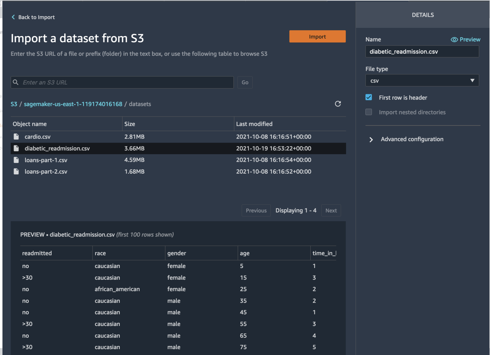 
* Once you import the dataset, choose Add analysis to start performing analyses on the raw imported data.
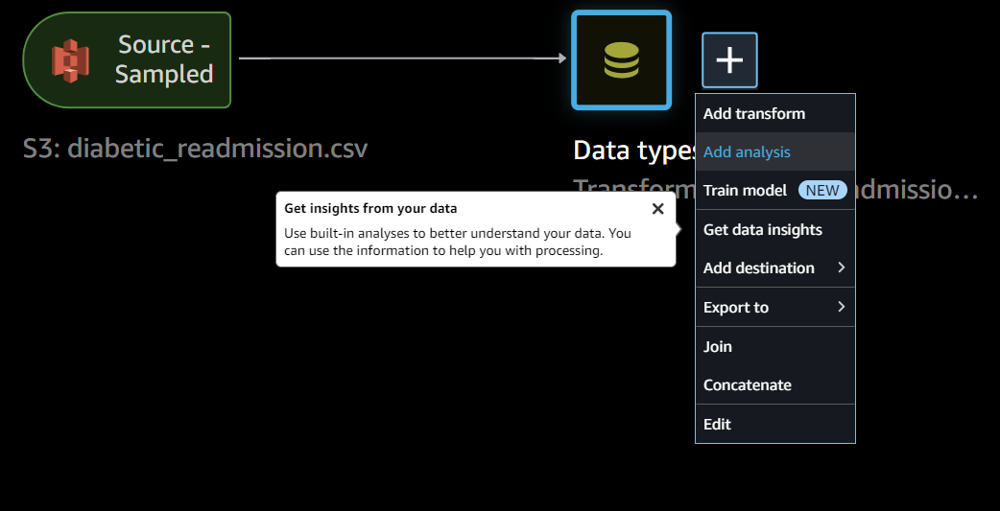 
* As you can see from the screenshot below, Data Wrangler provides many options for exploratory data analysis and visualization.
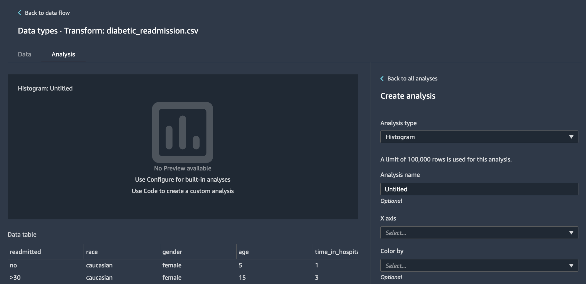
* As a first analysis, we will be looking into the raw feature columns to analyse if there are any correlations (linear) amongst the features. You can either choose linear correlation to evaluate linear dependency (Pearson's correlation) between features or non-linear to evaluate more complex dependencies (Spearman's rank correlation and Cramer's V). For this exercise, let's choose linear.
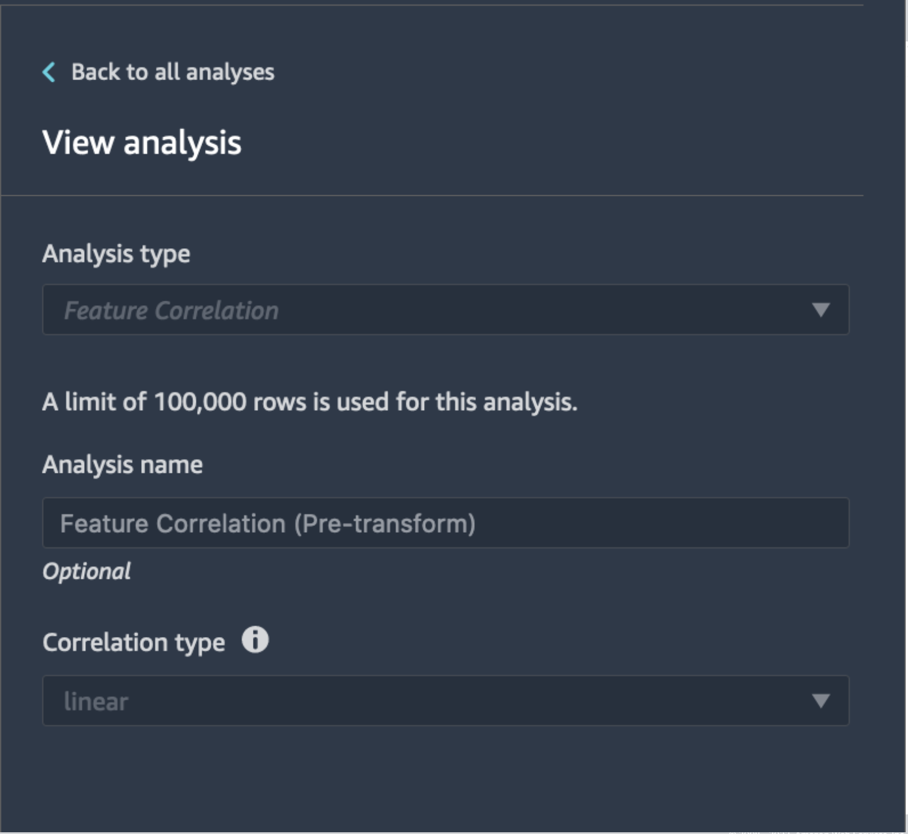
* Once you hit the preview button, within a few minutes, you can see the results which breaks down the correlation between the raw features alongside Pearson's correlation score. * You can also see the correlation matrix as a heatmap. This is automatically generated for you. Save the analysis.

# Feature Transformations
* Next, based on our initial exploratory analyses, lets apply some transformations to the raw features.
* To apply data transformation, click on "Add transform" as shown below.

* From the Transforms interface, click "Add step". Data Wrangler provides 400+ transforms that you can choose.
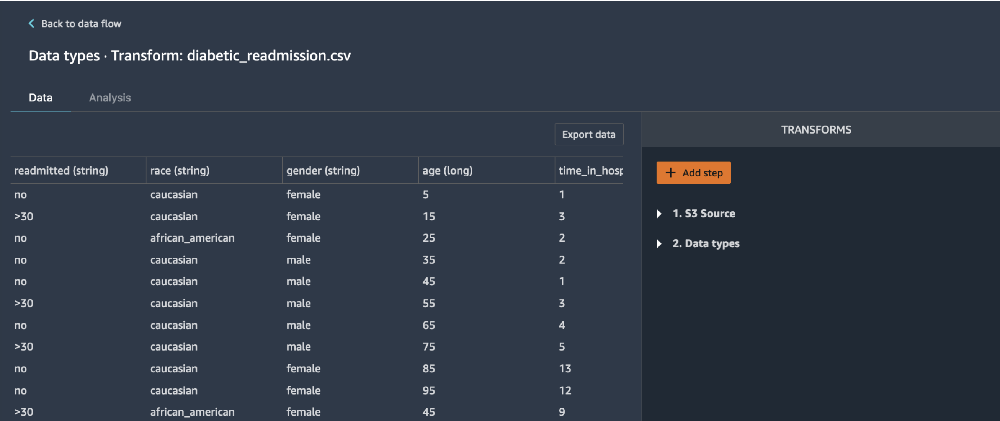
* Lets drop all the redundant columns based on our previous analyses. First, lets drop the max_glu_serum column as shown in the screenshot below.

* Similar to the above transform, lets also drop columns - a1c_result, gender, num_procedures and num_outpatient,
* Next, lets one hot encode the race column using the encode categorical option as shown below.
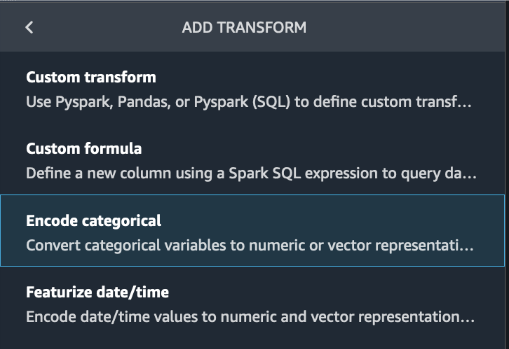

* Next, click on Back to data flow to head back to the data flow interface. You can also export the output the transformed features so far directly into S3 by clicking on the Export data button.
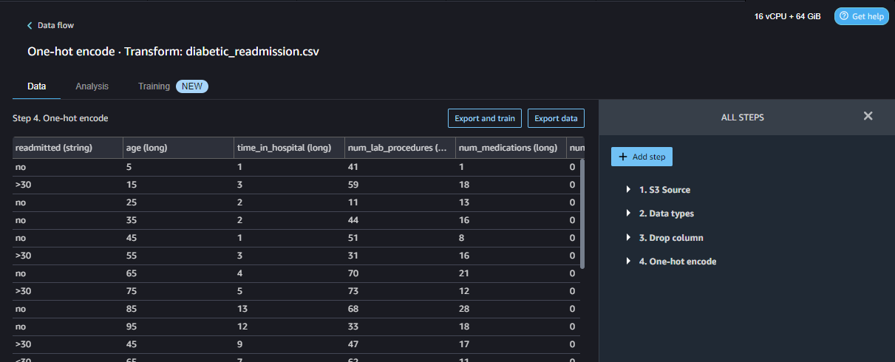
* Click on the export tab and select all the transforms to be exported as shown below.
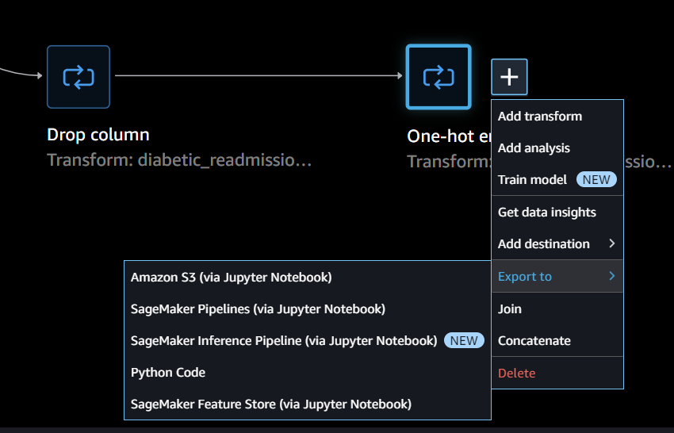
* For exporting, choose one of the many options that are available.
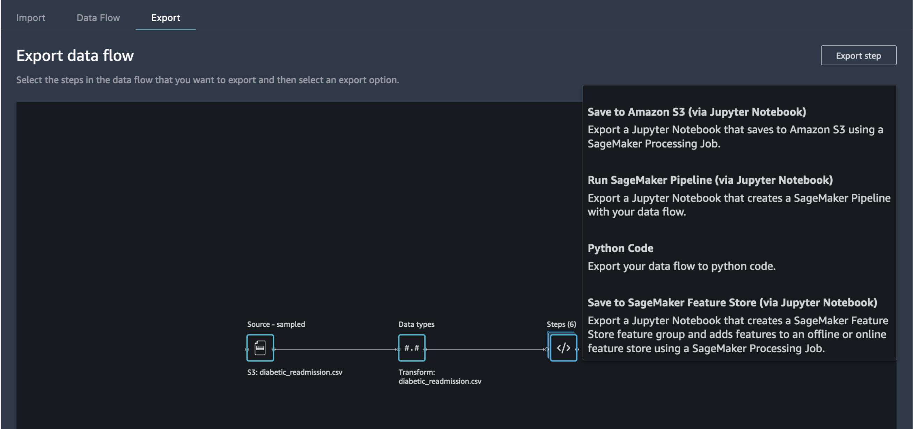

In the next part we will look at generating the best model using SageMaker Autopilot (AutoML)
