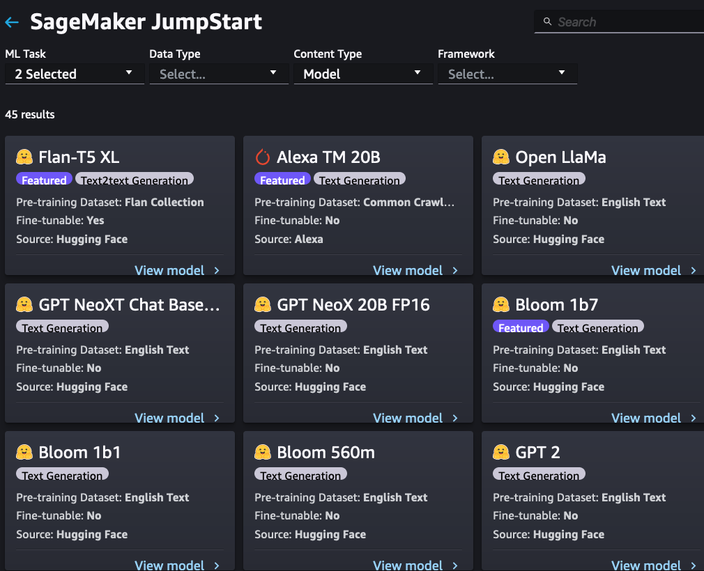

大規模言語モデルに関する最初のラボへようこそ。このラボでは、まず SageMaker Jumpstart を使って大規模な言語モデルをデプロイし、そのモデルを使って複数の教育関連のユースケースを試してみます。

このラボのノートブックは https://github.com/aws-samples/amazon-sagemaker-immersion-day-for-research/tree/main/10.%20Generative_AI/1.%20Education_QnA にあります。

このノートブックには ml.t3.medium インスタンスと DataScience カーネル を使用します。

## 大規模言語モデルのための SageMaker JumpStart
SageMaker JumpStart は、機械学習を始めるのに役立つ、さまざまなタイプの問題に対する事前学習済みのオープンソースモデルを提供します。Amazon SageMaker StudioのJumpStartランディングページから、訓練済みのモデル、ソリューションテンプレート、およびサンプルにアクセスできます。また、SageMaker Python SDKを使用してJumpStartモデルにアクセスすることもできます。

Amazon SageMaker JumpStartは、コンテンツ作成、コード生成、質問応答、コピーライティング、要約、分類、情報検索などのユースケースに対応した、最先端の組み込み基盤モデルを提供します。JumpStartの基盤モデルを使用して、独自の生成型AIソリューションを構築し、カスタムソリューションをSageMakerの追加機能と統合することができます。

付属のノートブックでは、まずjumpstart python SDKを使用してモデルを展開し、複数のソースを使用して以下のユースケースを実行します：

1. キーワード生成
2. 要約 
3. 正答チェック
4. QnAペアの生成
5. 以下のような質問
   1. ストーリーはどのようなものですか？
   2. 主人公は誰ですか？
   3. 最後にはどうなりますか？
   4. 論文の主な要旨は何ですか？
   5. 解決される問題は何ですか？
   6. 論文の結論は何ですか？